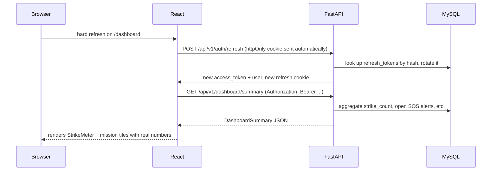
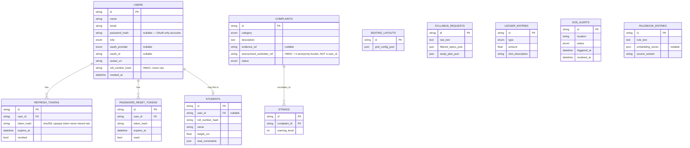

# Architecture

## Stack

- **Frontend**: React 18 + Vite, React Router 6, Tailwind CSS, `@react-oauth/google` for Google Identity Services, the raw Facebook JS SDK for Facebook Login, native `WebSocket` for the SOS live feed.
- **Backend**: FastAPI (async), SQLAlchemy 2.0 async ORM, Alembic migrations, MySQL 8.
- **Auth**: JWT access tokens (15 min, held in frontend memory only) + opaque refresh tokens (30 days, httpOnly cookie, hashed at rest, rotated on every refresh).

## Request flow for a protected page load

## ERD

## Key design decisions and trade-offs

**OAuth via popup SDKs, not redirect + callback route.** The original spec's folder tree has room for an OAuth callback page. We didn't build one, deliberately: both Google Identity Services (`@react-oauth/google`) and the Facebook JS SDK do the provider handshake in a popup/iframe and hand the frontend a verifiable credential directly, which we then send to our own backend for **server-side** verification (`oauth_service.py` calls Google's `id_token.verify_oauth2_token` and Facebook's `debug_token` Graph API endpoint). This avoids an extra hop and an extra page, and — critically — the frontend never gets to assert "this user is logged in" on its own; only our backend's verification against the provider decides that. Trade-off: this requires the OAuth app's authorized JavaScript origin to include your dev URL exactly; there's no server-side redirect URI to configure instead.

**Anonymity pipeline (Mission 1 + Mission 4).** `Complaint` and `LedgerEntry` rows never store a `user_id`. Where a submitter reference is needed at all (Mission 1, so a captain can see "3 complaints from the same anonymous source" for triage), we store `HMAC-SHA256(user_id, server_pepper)` further reduced into one of 64 k-anonymity buckets (`anonymity_service.py`). The pepper lives only in server config, never the database — a full DB leak yields bucket labels, not identities. **Known limitation, flagged rather than hidden**: if a bucket ever has exactly one member, that member is de-anonymized by elimination; a production version would need a submission-rate cap per bucket or a larger bucket count as the user base grows. This is called out here rather than silently left as a hidden gap.

**EXIF stripping re-encodes the image rather than just deleting the EXIF segment** (`exif_service.py`), so vendor-specific maker notes that `piexif` doesn't parse can't survive either.

**Refresh tokens are opaque, hashed, and rotated — not JWTs.** Storing only `sha256(refresh_token)` means a database leak alone doesn't hand over usable sessions, mirroring how passwords are handled. Rotation on every use means a stolen-but-unused refresh token stops working the moment the legitimate owner's client refreshes again.

**Mission 6 (fact-checker) and Mission 3 (syllabus) both degrade gracefully without network access.** `llm_service.py` and `embedding_service.py` fall back to a deterministic extractive summarizer and a local TF-IDF cosine-similarity index (scikit-learn) respectively when no `OPENAI_API_KEY`/`GEMINI_API_KEY` is set. This was a deliberate call for a hackathon demo on venue wifi: a feature that silently does nothing without an API key is worse than one that's honestly "less clever" but still fully functional offline.

**Seating algorithm is a per-column greedy height-ascending sort, not a full CSP solver.** The brief calls it a "constraint satisfaction / greedy" problem; we implemented the greedy version because it's provably optimal for the stated sightline model (front-to-back non-decreasing height per column is necessary and sufficient to avoid blocking) and is instant to compute for any roster size, versus a general CSP solver that would add real implementation risk for no accuracy gain given how simple the actual constraint is. Documented in `seating_algorithm.py`'s module docstring.

**SOS auth over WebSocket uses a `?token=` query param**, since browsers can't attach custom headers to the WebSocket handshake. This token is the same short-lived (15 min) access token already used for REST calls, so it doesn't introduce a new class of long-lived credential in a URL — it just reuses the existing short-lived one.

## What's deferred (see also README)

- **Rashid Sir's "impeachment tracker" screen.** The `teacher` role exists in the DB and is route-guardable today (same `require_roles` dependency every other privileged route uses), but no dedicated frontend screen was built for it in this pass — there simply wasn't a mission spec for what it should show beyond "impeachment tracker," and we didn't want to invent unspecified functionality silently.
- **Production S3 storage.** `exif_service.py`'s `strip_exif_and_store` writes to local disk today; the function signature is already the seam where an S3-backed implementation would slot in behind `STORAGE_BACKEND=s3` in config, but that implementation itself is not written.
- **Real transactional email.** `auth_service.request_password_reset` logs the reset link to the backend console in dev instead of sending an email — there's no email provider configured for the hackathon.
- **Per-bucket submission rate limiting for the anonymity pipeline** (see the k-anonymity note above) — noted as a known gap, not fixed in this pass.
